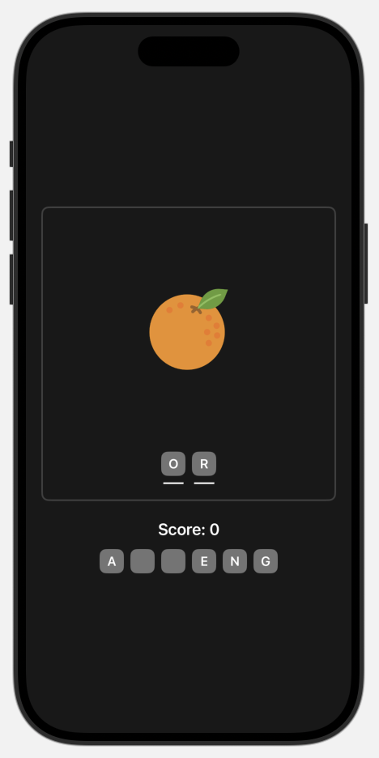

# Words Puzzle Game

## Overview

`WordsPuzzleGame` is a SwiftUI-based puzzle game where players need to guess scrambled letters to form words. The game presents a series of image-based questions, and the player interacts with the letters to unscramble them and form the correct word. The player receives feedback (success or failure) based on the accuracy of their guess. The game keeps track of the score and shows the final score once all questions are answered.

## Features

- **Dynamic Question Generation**: The game presents new questions each time, generating a random list of scrambled letters based on the current question.
- **Guessing Mechanism**: Players drag and drop letters to form words.
- **Success/Failure Feedback**: Success or failure is visually indicated with "tick" or "cross" images.
- **Score Tracking**: The game tracks the player's score and shows the final score at the end of the game.
- **Replayability**: After completing all questions, the game can be restarted with new questions and reset score.

## Screenshots



## App Structure

The app consists of the following main components:

### 1. **GameView** (Main Game Screen)
- The main screen where the user interacts with the game.
- Displays a question (image and scrambled letters) to guess.
- Displays feedback on the success or failure of the guess.
- Tracks and updates the score based on user actions.

#### Main Views:
- **LetterView**: A reusable view displaying a single letter that the user can interact with.
- **ScoreView**: Displays the final score at the end of the game.
  
### 2. **LetterModel** and **QuestionModel**:
- **LetterModel**: Represents a single letter in the puzzle, which can be scrambled and guessed.
- **QuestionModel**: Defines the structure for each puzzle question (including the image, answer, and scrambled letters).
  
### 3. **ScoreView**:
- Displays the player's final score after completing all questions.

---

## Code Explanation

### 1. **GameView.swift**

The core functionality of the game resides in the `GameView` structure. This view handles the logic for the entire puzzle game.

- `guessedLetters`: Keeps track of the letters that the user has selected and placed.
- `showSuccess`: Boolean value to show success feedback after a correct guess.
- `showFailure`: Boolean value to show failure feedback after an incorrect guess.
- `score`: Keeps track of the player's score.
- `questions`: List of all the questions, which includes scrambled letters, answers, and images.
- `currentQuestionIndex`: Keeps track of the current question being answered.

#### Key UI Elements:
- **Image**: Displays the image associated with the current question.
- **Scrambled Letters**: A horizontal list of scrambled letters that players can guess from.
- **Feedback**: A visual "tick" or "cross" appears to indicate the correctness of the answer.

### 2. **LetterView.swift**

This view is used to display a single letter. It is used within the `GameView` to display the scrambled letters and guessed letters.

```swift
struct LetterView: View {
    let letter: LetterModel
    
    var body: some View {
        Text(letter.letter)
            .font(.system(size: 16, weight: .semibold))
            .foregroundStyle(Color.white)
            .frame(width: 30, height: 30)
            .background(Color.white.opacity(0.4))
            .clipShape(RoundedRectangle(cornerRadius: 8))
    }
}
```
This view is visually styled to show the letter with a background, and the player can tap on it to interact.

### 3. **ScoreView.swift**

The ScoreView is presented at the end of the game to show the final score.

```swift
struct ScoreView: View {
    let score: Int
    let questionCount: Int
    
    var body: some View {
        ZStack {
            Color.background.ignoresSafeArea()
            VStack {
                Text("Final Score")
                    .foregroundStyle(.white)
                    .font(.system(size: 26, weight: .bold))
                Text("Score: \(score) / \(questionCount)")
                    .foregroundStyle(.white)
            }
        }
    }
}

```
It displays the score in a styled view with background color.

### 4. **QuestionModel.swift**
QuestionModel is a model that represents each puzzle's question. It contains an image, answer, and scrambled letters for the user to guess.

---

## How to Run

1. Clone the repository or copy the code into an Xcode project.
2. Open the project in Xcode.
3. Run the app on the simulator or a real device.

---

## Libraries Used

- **SwiftUI**: Used for building the app's UI components.
- **Foundation**: For managing data models.

---
